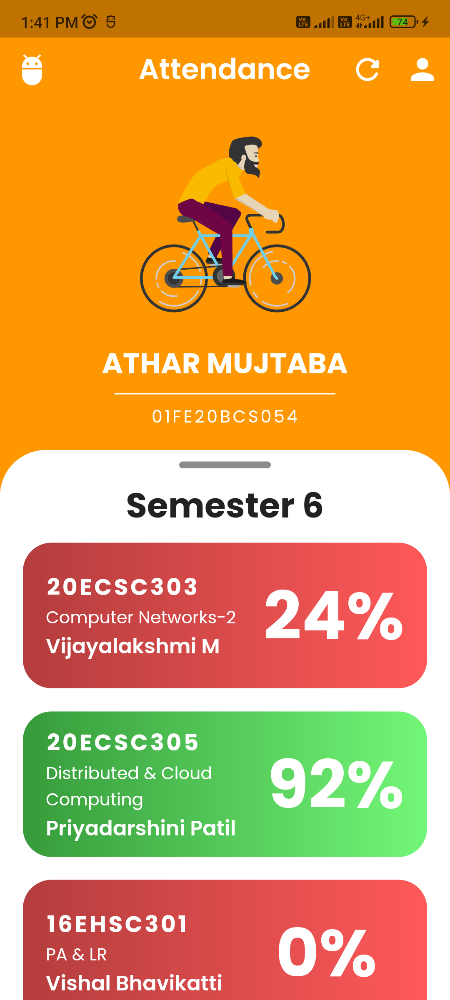
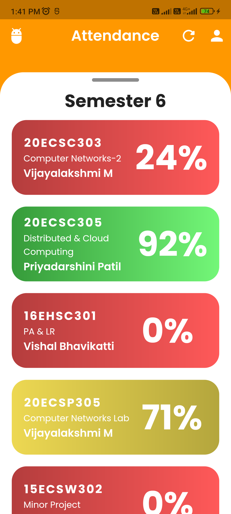
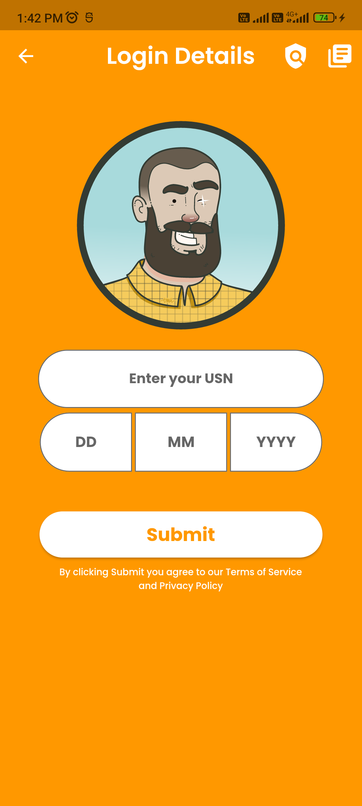

# kle-attendance
KLE Attendance or Attendd is cross-platform mobile app which will lets the student of KLE Technological University to access their attendence of each course

## Contribution Guidelines

Clone the project

```bash
  git clone https://github.com/WaniAthar/kle-attendance.git
```

Go to the project directory

```bash
  cd kle-attendance
```
Install dependencies

```bash
  flutter pub get
```

Start the app 

```bash
  flutter run
```

## Demo

 




