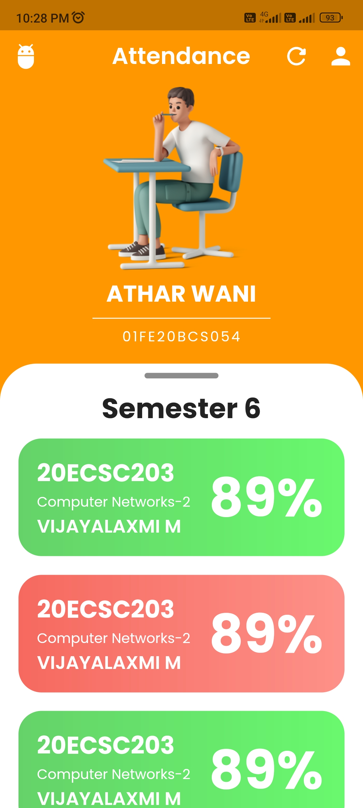
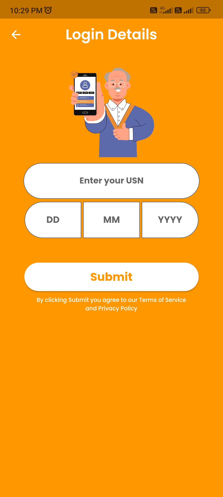

# kle-attendance
KLE attendance or just Attendance is an android app in development stage which will show the attendance percentage of each course on mobile phone

## Contribute to the project
**Clone this repository** `git clone https://github.com/WaniAthar/kle-attendance.git`

**In the terminal of that cloned repository type** `pub get --all` to install all the dependencies.

**Finally Type** `flutter run` to run the project.

#### if it didnt work, then create a new flutter project and move the files of this repo to that one.

## Here are some screenshots of the app  

 

